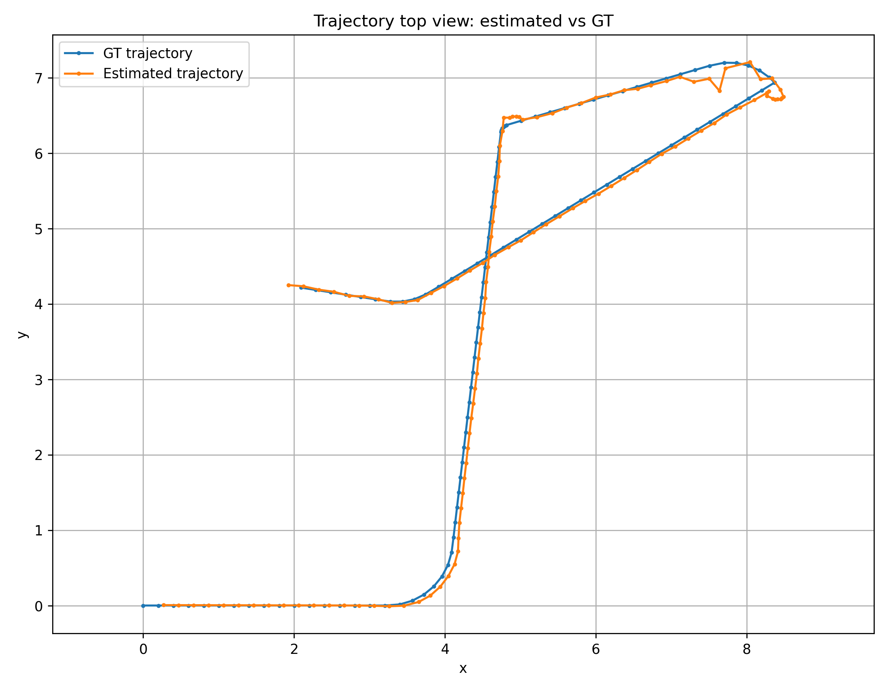
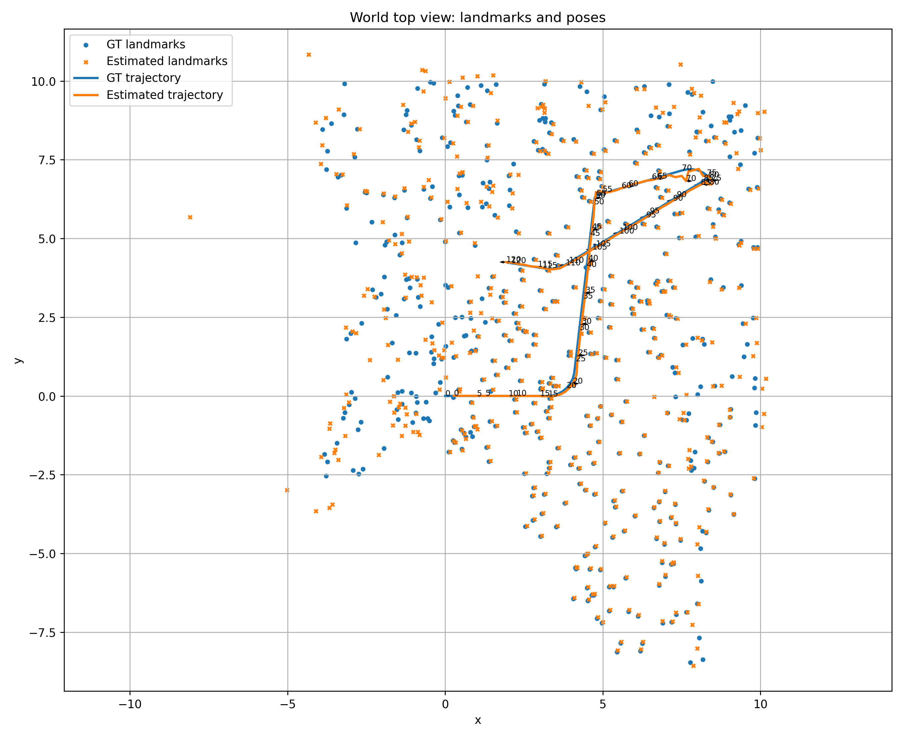
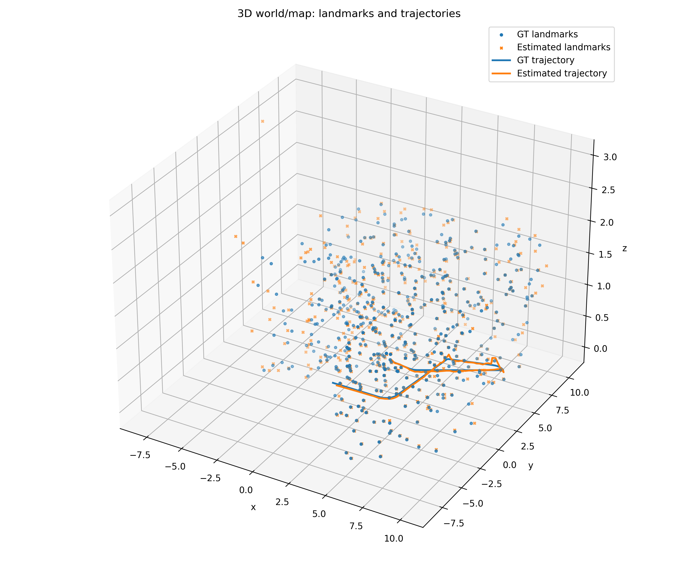
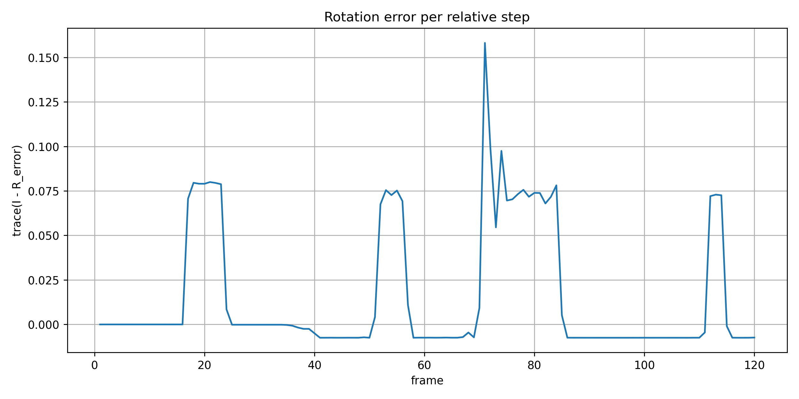
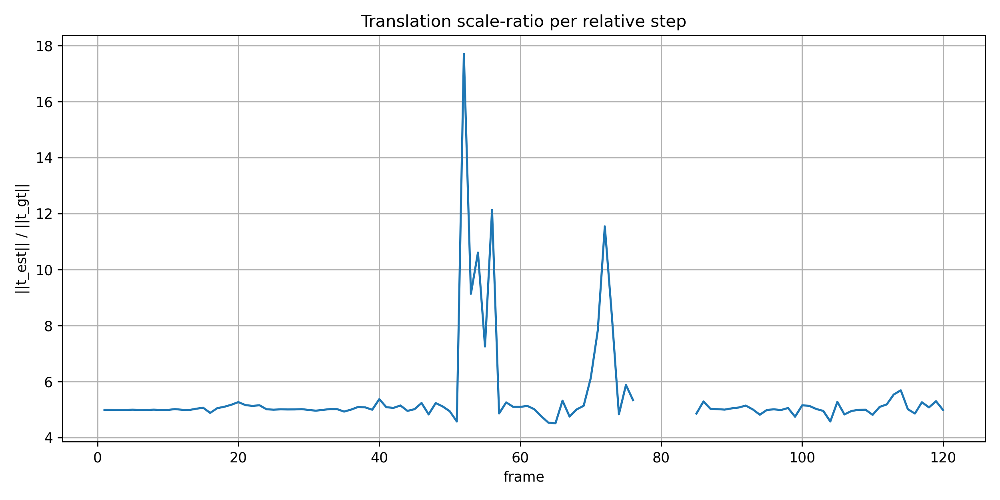

# Visual Odometry Project
This project aims to construct a monocular Visual Odometry pipeline for a moving camera observing landmarks in the images. While camera parameters known, neither camera nor landmark posiitons known. From sequence of 2D image measurements, system estimates the camera trajectory and the 3D landmark map.

Constructed pipeline, first performs epipolar initialization and triangulation on the first two image provided to initialize the pose of the camera and the map. For later frames, projective ICP performed on the landmarks present in the map, and newly observed landmarks added to the map using triangulation. For detailed procedure please see the chapter "Detailed Theoretical Procedure followed in the Project" and following subchapter "PICP Implementation into the main Pipeline".

Brief summary of the projective ICP logic used in the pipeline is as follows, 
  For each new frame, already-triangulated landmarks observed in the current image are used as 3D–2D correspondences. 
  Several initial pose guesses are tested, including constant SE(3) motion, translation-only motion, rotation-only motion, previous pose, damped motion, and faster motion. 
  The best candidate is selected by acceptance status, inlier count, inlier/projectable ratio. 
  PICP is run with progressively adjusted robust kernels.
  If a pose is accepted only with a large kernel, it is used for trajectory continuity but map growth is disabled.

Final evalution of the constructed map and the estimated trajectory done using the ground truth once after the process done fully. Evalution provides pose errors, translition scale consistency, map error, and visual plots.

The project uses the ready-to use dataset. Default data set folder is data/. The VO pipeline uses camera.dat and the image measurements meas-XXXX.dat. The landmark IDs in the measurements are used for data association. The files world.dat and trajectory.dat are not used by the VO algorithm; they are loaded only after VO finishes, inside the evaluation stage.

## Build and Run Instructions

Requirements: CMake, a C++17 compiler, Eigen3, OpenCV, Python3, NumPy, and Matplotlib.

From the repository root:

```bash
rm -rf build
cmake -S . -B build -DCMAKE_BUILD_TYPE=Release
cmake --build build -j
```

Optional checks:

```bash
./build/test_dataset_reader --dataset data
./build/test_initialization --synthetic
```

Run the full Visual Odometry pipeline and write the evaluation files:

```bash
rm -rf output/evaluation
./build/vo_main data output/evaluation
```

Generate the plots used in the report:

```bash
python3 tools/plot_evaluation.py output/evaluation output/evaluation/figures
```

The generated results are saved under:

```text
output/evaluation/
output/evaluation/figures/
```

`world.dat` and `trajectory.dat` are used only during the evaluation stage, not by the VO pipeline itself.

## Results & Discussion
Ovearall result can be summarized as folowwing,
  Full sequence successfully processed, 121 pose estimated and 490 landmark recovered.
  Trajectory follows the ground truth well perfectly in most of the path and the error peaks in some regions.
  The map is accurate after rigid allignment, with RMSE 0.392.
  Main weakness are the peaks rotation error and scale ratio in the few frames.

To recover the mismatch that comes from the fact that the pipeline uses the first frame as world frame not the real one, rigid alignment has been performed. And for the arbitrary scaling mismatch, scale correction performed.

Estimated trajectory follows the ground truth trajectory closely eventhough there are small deviations especially at the upper right part of the trajectory. The rotation error is close to zero for the bigger portion of the sequence. Larger rotation errors appear in short intervals, mainly around the frames where the camera motion changes direction. These peaks explain why before the new initial guess algorithm, in the first version the pICP algorithm worked poorly. 

Reconstrudted map contains 490 landmarks and their position mostly overlaps with the groundtruth, altough thereare considerable mismatch in few indivual landmarks. The raw map RMSE is high because the VO map is expressed in the first camera frame, while the ground-truth map is expressed in the dataset/world frame. After rigid alignment, the map RMSE decreases to 0.392 and the mean landmark error becomes 0.171.

Scale is reasonably consistent, the scale ratio stays around 5 so the map is scaled by 0.199. Local peaks in the scale ratio happens in the same frames as rotation error peaks.

### Output Summary
|Reconstruction||
|---------------|-------------|
|VO success|Yes|
|#Estimated Pose|121|
|#Reconstruct Landmark|490|
|Pose Evaluation||
|---------------|-------------|
|Mean Rotation trace error|0.0158|
|Median Rotation trace error|-0.0002|
|Mean trnslation scale ratio|5.4394|
|Median translation scale ratio|5.0133|
|Map scale factor|0.1995|
|Map Evaluation||
|---------------|-------------|
|Rigid-aligned map RMSE|0.3924|
|Rigid-aligned mean landmar error|0.1706|

### Plots

#### Trajectory: estimate vs ground truth


#### World top view: landmarks and poses


#### 3D landmarks and trajectory


#### Rotation error


#### Translation scale ratio


## Detailed Theoretical Procedure followed in the Project

We have a robot with camera so a moving camera. We are in a world full of id-ed landmarks, yet we don’t have the map of the world. At each observation we are receiving a 2D image from the camera that contains some of the id-d landmarks.

We will use epipolar geometry to initialize our algorithm and map. Then we will use projective-ICP to perform odometry. 

So the main visual odometry pipeline will have the following structure, defining k as the k-th discrete-time / measurement instant,

Initialization k = 0,1

  Take initial measurements. → Frame 0 & Frame 1

  Perform Epipolar Geometry to recover initial pose at instant 1 w.r.t the world (Frame 0).

  Perform Triangulation on the common landmarks of measurement 0 and 1 to create the initial map. 

Visual Odometry k $\geq$ 2

  Take the k-th measurement.

  Perform ICP on the landmarks that has correspondence in the map.

  Estimate the k-th instant pose.

  Using the pose, triangulate the landmarks that has no correspondence on the map but has correspondences in the old measurements. Relatedly, update the map.

### Initialization

First two image observations, image 0 & image 1, being taken,

→ If we have less then 8 correspondences give error. Because we will use 8 point algorithm.

→ Find the correspondences of the landmarked in the images, that is find the landmarks that are appeared in both of the images. 

→ Use the camera frame of image 0 as the world frame.

For every matched landmark in the images, recover the bearings $d$ of the cameras from the images by undoing the camera matrix, and normilize. 

$$z_0 = \begin{Bmatrix}u_0 \\\\ v_0 \\\\ 1\end{Bmatrix}$$ and $$z_1 = \begin{Bmatrix}u_1 \\\\ v_1 \\\\ 1\end{Bmatrix}$$ undo,  $$\begin{matrix}\bar{d}_0 =\\\\ \bar{d}_1 = \end{matrix} \begin{matrix}K^{-1}z_0 \\\\ K^{-1}z_1\end{matrix}$$ normalize,  $$d = \frac{\bar{d}}{\vert\vert\bar{d}\vert\vert}$$

Then use the condition of intersection $d_1^TEd_0=0$ to calculate the matrix $E$. For this first build the matrix $A$ for each correspondence using the bearings, then find $H$ and calculate its smallest eigenvalue and the corresponding eigenvector, recover $E$ from the eigenvalue.

$A_i = (d^x_1d^x_0\\:\\:d^x_1d^y_0\\:\\:d^x_1d^z_0\\:\\:d^y_1d^x_0\\:\\:d^y_1d^y_0\\:\\:d^y_1d^z_0\\:\\:d^z_1d^x_0\\:\\:d^z_1d^y_0\\:\\:d^z_1d^z_0)$ “for the i-th landmark”

$H = \sum_i A_i^T A_i$ → let’s $e$ be the eigenvector corresponding to smallest eigenvalue.

Finally recover $E$ from vector $e$.

Now we can compute the transformation matrix from the world frame to the first camera frame using the matrix $E$.

Let’s define the SVD decomposition of $E = USV^T$ . Then, $R = UWV^T$  or  $R = UW^TV^T$ and, $t_{skew}=VSW^TV^T$  or $-t_{skew}=VSW^TV^T$ 

where, 

$$W = \begin{Bmatrix} 0 & 1 & 0 \\\\ -1 & 0 & 0 \\\\ 0 & 0 & 1 \end{Bmatrix}$$

Notice, we have four possible pairs for $R$ & $t$. In order to be able to choose the suitable pair we will test each of them and find the one that result in positive sclaing values for both camera instant since the camera line must be in front of the camera. For one matched landmark point on the image let’s call it $p$,

$p=s_0d_0=t+Rd_1s_1$

$(d_0\\:\\:-Rd_1)(s_0\\:\\:s_1)^T=t$  

$(s_0\\:\\:s_1)^T=[(d_0\\:\\:-Rd_1)^T(d_0\\:\\:-Rd_1)]^{-1}(d_0\\:\\:-Rd_1)^Tt$

⇒ Choose the pair that result in $s_0 \geq 0$ and $s_1 \geq 0$

Moreover, note that we recover only the direction of $t$ not it’s magnitude,

$t \sim \alpha t$ → so we can set at initiliziation $\vert\vert t \vert\vert=1$

Now we have the positions of the landmarks w.r.t to the world frame using triangulation, for each landmark i,

$p^i_{world}=\frac{1}{2}(s_0d_0+t+s_1Rd_1)$ 

Where we took the average from the image 0 and 1 as a robustness measure against noise.

Of course we also have trajectory from instant 0 to instant 1,

$$X^{cam}_{world}=\begin{pmatrix}R&t\\\\0&1\end{pmatrix}$$

### Projective ICP

First we need to match the id-ed landmarks with the landmarks in the map for the k-th measurement/incoming image.

#### For the landmarks in the map

Carry out projective-ICP,

##### State Space

Qualify the domain → $X^k \in SE(3)$ 
  
  $$X^k=\begin{pmatrix} R^k & t^k \\\\ 0 & 1 \end{pmatrix}$$ 

Euclidian parametrization of the perturbation

→ $\Delta x\in \mathbb{R}^6\\\\:\vert\\: \Delta x = (x\\:\\:\\:y\\:\\:\\:z\\:\\:\\:\alpha_x\\:\\:\\:\alpha_y\\:\\:\\:\alpha_z)^T$

Box plus operator → $X^k \boxplus \Delta x = v2t(\Delta x)X^k$

##### Observation Space

Qualifying the domain

→ $z^m\in \mathbb{R}^2\\:\vert\\:z^m=(u^m\\:\\:\\:v^m)^T$ ,where $p_{img}=(u^m\\:\\:\\:v^m\\:\\:\\:1)^T$

Observation model → $z^m =h^m(x)=proj(K{X^k}^{-1}p^k)$

##### Error functions 

→ $e^{n,m}(X^k)=h^n(X^k)-z^m$

→ $e^{n,m}(X^k\boxplus \Delta x)=h^n(X^k\boxplus \Delta x)-z^m$

Where $X^k$ will give us the $k$-th instant of the camera w.r.t world. 

#### For the landmarks not in the map

If there exist a landmark that is not on the map; find if there is correspondence in previous images, and if so perform the triangulation to add those landmarks into the map (if not store it for later as it is).
    
The camera posses of the two images w.r.t world are known, and let’s say the old image is the j-th image.

  $z_j = (u_j\\:\\:v_j\\:\\:1)^T$ & $z_k = (u_k\\:\\:v_k\\:\\:1)^T$ 
  
  undo the Camera matrix, $\bar{d} = K^{-1}z$
  
  normilize, $d = \frac{\bar{d}}{\vert\vert\bar{d}\vert\vert}$
    
then for the newly discovered landmark $n$,
    
  $p^n_{world}=t_j + R_j\\:d_i\\:s_j = t_k + R_k\\:d_k\\:s_k$
    
  $$[R_j\\:d_j\\:\\:\\:\\:-R_k\\:d_k]\begin{Bmatrix}s_j\\\\s_k\end{Bmatrix}=t_k-t_j$$
    
find $s_j$ & $s_k$ and accept to the map iff they are $\geq0$.
    
  $p^n_{world}=\frac{1}{2}(t_j + R_j\\:d_i\\:s_j\\:\\:+\\:\\: t_k + R_k\\:d_k\\:s_k)$

### PICP Implementation into the main Pipeline

Algorithm that is inspired by RANSAC however a brutally simplified version (and it is deterministic no randomization) can be implemented. Instead of trying many random guess, try six possible guess, choose the best one. Start the PICP with high kernel and then as PICP accepted reduce the kernel and use the accepted PICP solution as initial guess. When PICP is rejected, try with higher kernel and if accepted try to reduce the kernel. If PICP is not accepted at all rescue kernels attempted for continuity of the map, and if this does not work algorithm reports failure.

For the k-th frame,

1. Build trusted 3D–2D matches.
2. Generate multiple initial guesses:
    - full constant SE(3) motion
    - translation-only motion
    - rotation-only motion
    - previous pose
    - damped constant motion
    - faster constant motion
3. Run PICP from each guess.
4. Pick the best candidate by scoring logic,
    - accepted candidate beats rejected candidate
    - then larger inlier count
    - then larger inlier/projectable ratio
    - then larger inlier/known ratio
    - then lower median error as tie-breaker only
    - then lower mean error as final tie-breaker only
5. Extract inliers from the best candidate.
6. Rerun/refine PICP using only those inlier correspondences.
7. Validate the refined pose again on all correspondences.
8. Define the acceptance thresehold through raito of projectable points to inliers.
9. If accepted → mark it as 1st order accepted PICP and rerun with lower kernel and 1st order accepted PICP as initial guess.
10. If accepted → mark it as 2nd order accepted PICP and rerun with lowest kernel and 2nd order accepted PICP as initial guess.
11. If rejected → Rerun the sequence using higher kernel.
12. If rejected → Rerun the sequence using highest kernel.
13. If accepted → Use the accepted PICP as initial guess and try lower kernel until lowest one reached. 
14. For any PICP that is accepted at least with accaptable kernel (use the accepted PICP with lowest kernel) add to the map, grow the map and continue.
15. If PICP succeed with high kernels but not with accaptable kernel accept it for the continuity of the trajectory but do not update the map with it.   
16. Even if PICP accepted, if the number of projectible landmarks less then somethershold do not update the map with the result but use it only for continuity of the trajectory.  
17. If PICP rejected tryout first rescue kernel.
18. If PICP rejected tryout second rescue kernel. 
19. If still no accepted PICP tryout with less strict acceptance threshold. 
20. If after “rescue operations” PICP accepted → rerun algorithm using accepted PICP as initial guess. 
21. If after “rescue operations” still fails report failure.
